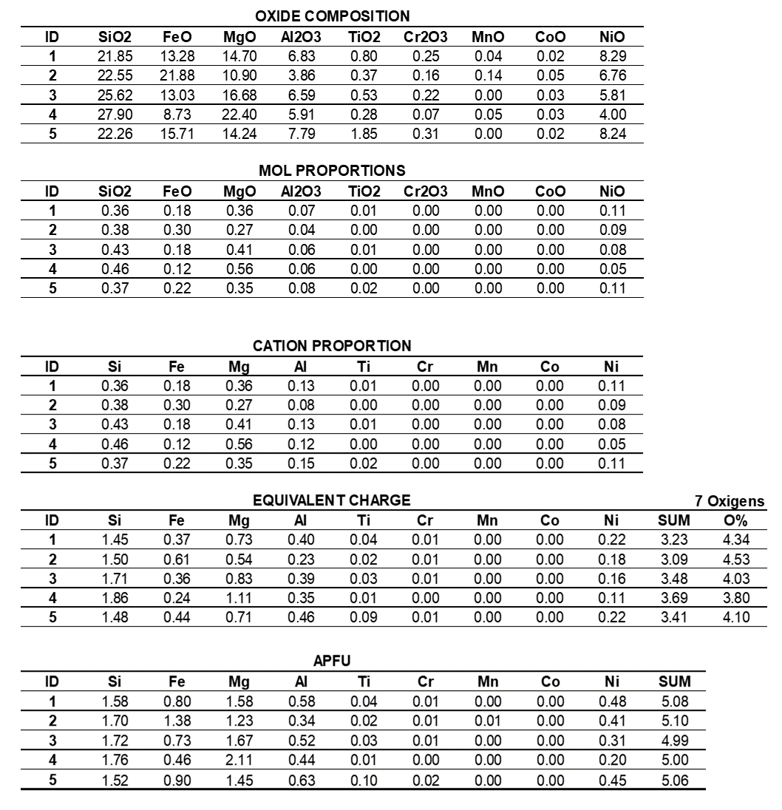

# Element to Oxide chemical data coversor

**Authors:** [**mattlamachado**](https://github.com/mattlamachado) / [**gambetta-p**](https://github.com/gambetta-p)

**Email**: mattlamachado@gmail.com

---

## Description
 It's designed after geological application, to easy the transformation of chemical data from element to oxide and vice versa.

Providing a Oxygen basis of a mineral, it's able to convert oxide mineral data to molar normalization.

 It receives an excel file, check each column against a conversion base sheet and produce a new DataFrame with the converted data.

---

 ## Workflow
 An ***Oxide*** mineral data table with the right valency must be used in order to produce a right molar transformation, based on the nature of the mineral.

A ***Mol Proportion*** table if produced dividing the oxide table by their respective ***Molecular Mass***, subsequently it's multiplied by the amount of ***Cations*** within the ***Oxide Formula*** (e.g. Fe2O3's multiplication factor = 2; FeO = 1), producing the ***Cation Proportion*** table.

The ***Cation Proportion * Valency of Elementes = Equivalent Charge***. The negative charge of Oxygen (e.g., Chromite (Fe<sup>2+</sup>Cr<sub>2</sub>O<sub>4</sub>) &rarr; 4O * -2 = -8) is divided (in absolute values) by the ***Sum*** of ***Equivalent Charges*** reaching a Oxygen proportion factor, that will be multiplied by the ***Cation Proportion*** and find the ***Atoms per Formula unit*** at last.

Example: 
Lizardite &rarr; Mg<sub>3</sub>Si<sub>2</sub>O<sub>5</sub>(OH)<sub>4</sub>

In this case, the hydroxyl accounts for half of the oxygens, it's like 7Os (-14) are used to balance the elements except Hydrogen, as it follows:



### Extra observations / bugs

when filtering a DataFrame, the index must be initiated in zero, for some reason I dont know yet the convertion functions cant loop within a index not startin in zero. So, do a: 
```
DataFrame.reset_index(inplace=True)
```


```bash
conda create -n elemox python=3.9.12
conda activate elemox
pip install -r requirements.txt
```

